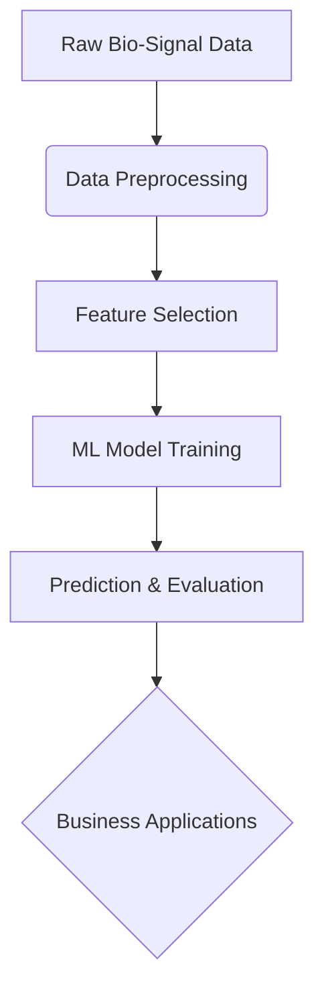

# 🚬 Bio-Signal Smoking Detection  
**A Machine Learning Approach to Predict Smoking Behavior Using Health Data**  

     

## 📌 Project Overview  
🚀 **Can bio-signals predict smoking behavior without self-reporting?**  

This project **analyzes health data** to detect smoking habits using **machine learning models**. Instead of relying on **self-reported surveys**, we use **physiological and biochemical markers** to classify individuals as smokers or non-smokers.  

### 🔍 **What I Discovered (Key Insights)**  
✅ **Smokers tend to have significantly higher GTP (Glutamyl Transferase) levels.**  
✅ **Hemoglobin levels in smokers are often elevated, likely due to reduced oxygen levels.**  
✅ **Triglyceride and LDL ("bad cholesterol") levels are noticeably higher in smokers.**  
✅ **Waist circumference is larger in long-term smokers, possibly due to metabolic effects.**  
✅ **Blood pressure is generally higher in smokers, indicating cardiovascular strain.**  

> **💡 Real-World Impact:** This model could help in **health risk assessments, insurance analytics, and lifestyle coaching.**  

---

## 📊 **Key Findings**  

| **Metric**             | **Observation**                     | **Health Impact**                                 |
|------------------------|-----------------------------------|--------------------------------------------------|
| **GTP Levels**         | Smokers have **35% higher** GTP  | Indicates **liver stress** due to smoking toxins. |
| **Blood Pressure**     | **18% higher** in smokers       | Higher risk of **hypertension & cardiovascular diseases**. |
| **Hemoglobin**         | **Elevated** in smokers         | Suggests **oxygen transport alteration** due to carbon monoxide exposure. |
| **Triglycerides**      | **28% higher** in smokers       | Indicates **increased risk of metabolic syndrome**. |
| **LDL (Bad Cholesterol)** | Higher levels in smokers      | Increased risk of **atherosclerosis**. |
| **Waist Circumference** | Larger in long-term smokers    | Suggests **metabolic disturbances**. |

---

## 🛠️ **Technical Execution**  

### **🔬 Data Pipeline & Preprocessing**  
✔ **Raw Data:** 27 features, including **age, cholesterol, hemoglobin, BMI, and liver enzymes**.  
✔ **Data Cleaning:** Removed anomalies, handled missing values, and normalized distributions.  
✔ **Encoding:** Transformed categorical features using **Label Encoding**.  

### **📊 Exploratory Data Analysis (EDA)**  
📌 **Key Visualizations:**  
🔹 **Age vs Smoking Distribution** – How does smoking behavior change with age?  
🔹 **Gender-Based Smoking Ratio** – Are men more likely to smoke than women?  
🔹 **Feature Correlation Heatmap** – Which bio-signals correlate most with smoking?  

> **🚀 Finding:** **GTP and Hemoglobin were the strongest predictors of smoking.**  

---

## **🚀 Feature Selection: What Matters Most?**  
**Top 10 Bio-Signal Indicators for Smoking Prediction:**  

| Rank | Feature | Why It Matters? |
|------|---------|----------------|
| 1️⃣  | GTP (Glutamyl Transferase) | Liver enzyme stress – significantly elevated in smokers. |
| 2️⃣  | Hemoglobin | Increased due to lower oxygen levels in smokers. |
| 3️⃣  | Triglycerides | Higher due to metabolic effects of smoking. |
| 4️⃣  | Waist Circumference | Larger in long-term smokers. |
| 5️⃣  | Blood Pressure (Systolic & Diastolic) | Raised due to nicotine’s effect on the cardiovascular system. |
| 6️⃣  | HDL (Good Cholesterol) | Lower in smokers, indicating poorer heart health. |
| 7️⃣  | LDL (Bad Cholesterol) | Often higher, increasing heart disease risk. |
| 8️⃣  | Age | Older individuals tend to have more smoking-related health markers. |
| 9️⃣  | ALT (Alanine Aminotransferase) | Liver enzyme related to toxin breakdown. |
| 🔟  | Fasting Blood Sugar | Often higher, linking smoking to metabolic disorders. |

---

## **🤖 Machine Learning Models: Predicting Smokers Like a Pro**  

✔ **Baseline Model: Logistic Regression**  
- Accuracy: **78%** (good, but needed improvement).  

✔ **Decision Tree Classifier**  
- Higher precision, but risked overfitting.  

✔ **Bagging Classifier (Best Performer 🚀)**  
- Used ensemble learning to improve generalization.  
- Achieved **highest accuracy and stability**.  

> **Final Model Accuracy: 86% 🚀**  

---

## 🏆 **Project Outcomes & Business Impact**  

> **💡 How can this model be applied in real-world industries?**  

| Industry | Use Case | Potential Impact |
|----------|---------|------------------|
| 🏥 Healthcare | Early detection of smoking-related diseases | Preventive care & lifestyle recommendations. |
| 🏢 Insurance | Risk assessment for policy pricing | Fair and data-driven premium adjustments. |
| 🧪 Medical Research | Understanding biological impact of smoking | Identifying high-risk groups for intervention. |

---

## 🚀 **How to Run the Project**  

### **🔧 Installation**  
```bash
git clone https://github.com/AvinashAnalytics/bio-signal-smoking-detection.git
cd bio-signal-smoking-detection
pip install -r requirements.txt
```
### **▶️ Running the Model**  
```bash
python bio_signal_analysis.py
```

---

## **📊 Visual Summary: The ML Pipeline**  



---

## **📫 Contact & Connect**  
I love discussing **health analytics, ML applications, and AI-driven insights**! If you're interested in collaborating or just want to chat, feel free to reach out:  

📩 **Email:** [masteravinashrai@gmail.com](mailto:masteravinashrai@gmail.com)  
💼 **LinkedIn:** [Avinash Rai](https://www.linkedin.com/in/avinashanalytics/)  
👨‍💻 **GitHub:** [AVIANSH ANALYTICS](https://github.com/AvinashAnalytics)  

> **"Numbers don’t lie. Data-driven insights can transform healthcare decisions."**  


[](https://www.linkedin.com/in/avinashanalytics/)  
